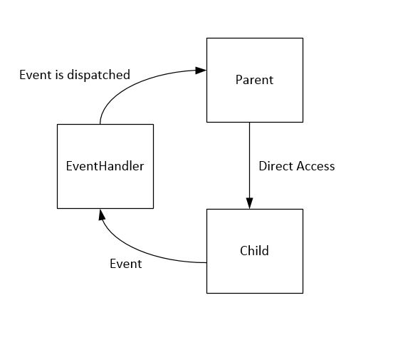

# child_parent_event
How a child class sends data to the parent class via events

### Problem Statement
In this tutorial, we will see how data can be exchanged between a parent and child. There is a sample in python.

### Description
A Parent sequence can access child's methods directly. One way for child to access parent's methods is to use events. The child can send an event to an event handler. If the parent listens to that event, the event handler will dispatch the event data to it.

In the given example, run the parent.py. It sends a message to the child (directly by accessing its method). In response, the child sends an event.
The EventHandler dispatches the event to all listeners. Since Parent listens to that event, it receives the response.
